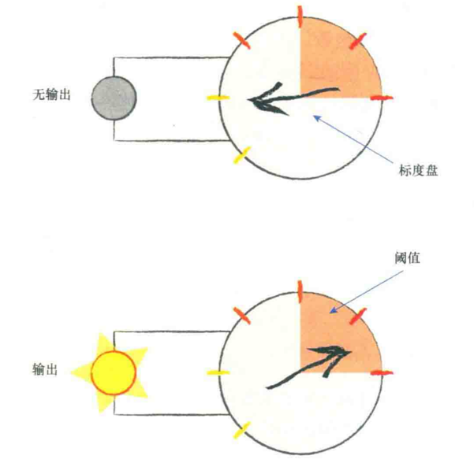
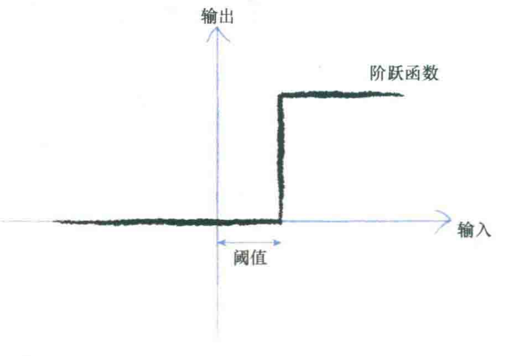
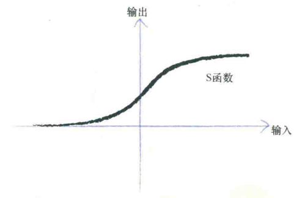
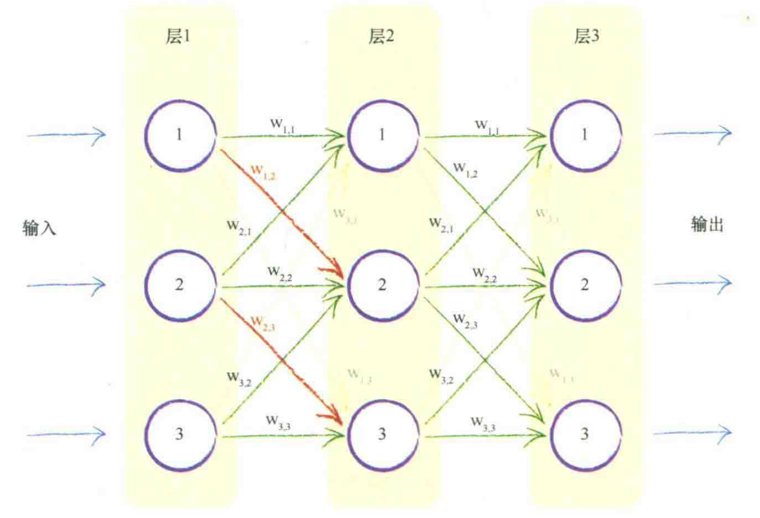

# make_your_own_neural_network

第1章 神经网络如何工作  
**“从你身边所有的小事情中，找到灵感。”**  

* 很多有趣的问题是没有一个简单的数学公式将输出和输入关联起来。这就是我们需要
神经网络这样相对成熟而复杂的方法的原因。

* 如果输出值越来越接近正确答案，即误差越来越小，那么我们就不要做比较大的调整。
使用这种方式，可以避免超调的结果。  

* 神经网络核心：我们训练机器，使其输出值越来越接近正确的答案。

* 当我们在训练时，使用各个训练数据样本进行改进，那么我们所得到的是，最终改进
的直线与最后一次训练样本非常匹配。实际上，最终改进的直线不会顾及所有先前的
训练样本，而是抛弃了所有先前训练样本的学习结果，只是对最近一个实例进行了学习  

* 为了避免上面的问题，引入了学习率

* 神经网络的一个重要的设计特征来源于对线性分类器的局限性的理解

* 神经元对输入不会立即反应，而是会抑制输入，直到输入增强，强大到可以触发输出。
可以认为，在产生输出之前，输入必须到达一个阈值。就像水在杯子--直到水装满杯子。
直观上，这是有道理的--神经元不、希望传递微小的噪声信号，而只是传递有意识的明显
信号。

这就像脑子要记住东西一样，需要有足够强大的刺激才能记住。  
可能对于一部分人就需要有强大的情感刺激，如恐惧，愤怒等。可能这也是为什么人们
对这些场合的记忆会印象深刻。  
那么敏感的人是否是阈值较低，一有信号神经元就触碰。  
可能亢奋的人也是这样吧。

Sigmoid函数，比起冷冰冰、硬邦邦的阶跃函数要相对平滑，这使得这个函数更自然、更接近现实。
自然界很少有尖锐的边缘。

* 为什么必须把前后层的每一个神经元与所有其他层的神经元互相连接
1) 形式一致的完全连接形式事实上可以相对容易地编码成计算机指令。
2) 神经网络的学习过程将会弱化这些实际上不需要的连接（也就是这些连接的权重趋于0）
因此对于解决特定任务所需最小数量的连接冗余几个连接，也无伤大雅。
**当权重为零或接近于零，权重与信号相乘意味着为零，可以认为链实际是断开的**

* 矩阵如何帮助简化神经网络的输入、输出计算呢？
1) 矩阵允许我们压缩所有这些计算，把它们变成一种非常简单的缩写形式
2) 编程语言可以高效的进行矩阵计算

* 通过神经网络向前馈送信号所需的大量运算可以表示为矩阵乘法
* 不管神经网络的规模如何，将输入输出表达为矩阵乘法，书写简便
* 编程语言可进行高速计算

**中间隐藏层的每个节点都与输入层的每个节点相连**

**S函数在0,1之间**

* 神经网络的计算: 组合输入信号,应用链接权重调节这些输入信号，应用激活函数，生成这些层的
输出信号

$X = W \cdot I$

* 最难理解一步：将神经网络的输出值与训练样本中的输出值进行比较，计算出误差。
使用误差值来调整神经网络本省，进而改进神经网络的输出值。

权重：
1) 在神经网络中，使用权重，将信号从输入向前传播到输出层
2) 使用权重，将误差从输出向后传播到网络中

